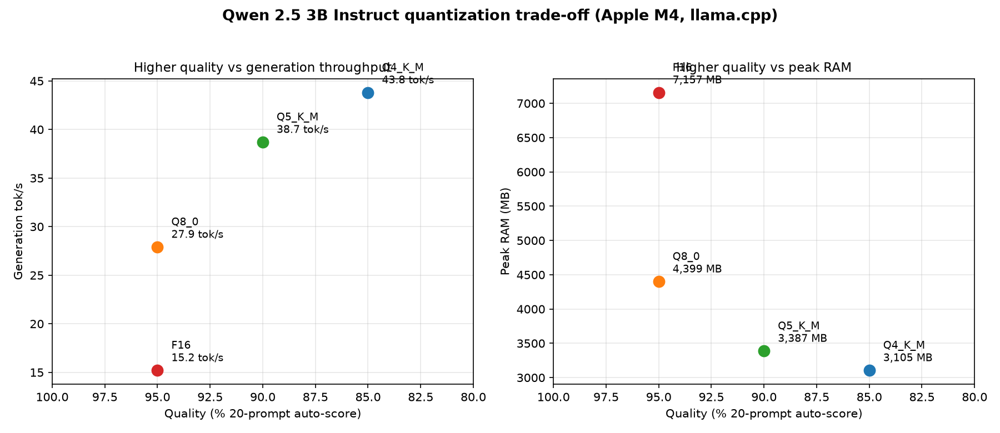

# llm-quantization-bench

[](https://github.com/kroeungcyber/llm-quantization-bench/actions/workflows/ci.yml)

Throughput / latency / quality trade-offs of quantized open-source LLMs on commodity hardware.

## What / why

We take one model — **Qwen 2.5 3B Instruct** — and measure it at four quantization levels
(**F16, Q8_0, Q5_K_M, Q4_K_M**) via llama.cpp on an Apple M4. The question is the classic
"Performance Optimization" one: **what does quantization actually cost you in quality, and what
does it buy you in speed and memory?**

Same model, same prompts, same seeds, same machine — the only variable is the quant. The result
is a clean, honest trade-off: generation throughput climbs 2.9× and peak RAM drops ~57% as you go
from F16 to Q4_K_M, while an objective 20-prompt quality score slides from 95% to 85%.

## Hardware & versions (reproducibility)

| Component | Value |
|---|---|
| CPU/GPU | Apple M4 (Metal) |
| RAM | 16 GB |
| OS | macOS |
| llama.cpp | `v10360` (Homebrew) |
| Model | Qwen2.5-3B-Instruct (HF: `bartowski/Qwen2.5-3B-Instruct-GGUF`) |
| Benchmark params | prompt 512 tok, gen 128 tok, reps 3, temp 0, seed 42 |
| Quality eval | 20 fixed prompts (arithmetic / exact-fact / code / instruction), objective auto-score |

### Model files

| Quant | File | Size | SHA-256 |
|---|---|---|---|
| F16 | `Qwen2.5-3B-Instruct-f16.gguf` | 5.8 GB | `25908e409af8c952a17c8fda44b90e699565a90436431574f44c25d140aa5032` |
| Q8_0 | `Qwen2.5-3B-Instruct-Q8_0.gguf` | 3.1 GB | `12491ec9f03aab7f0b96cdb7742695e6583d17ee129de48332d04b9cf6acd960` |
| Q5_K_M | `Qwen2.5-3B-Instruct-Q5_K_M.gguf` | 2.1 GB | `e4180cbad78d8848bd10839e7fd07edd573c4a5b01148c2b3f7ce2763a2a0938` |
| Q4_K_M | `Qwen2.5-3B-Instruct-Q4_K_M.gguf` | 1.8 GB | `9c9f56a391a3abbd5b89d0245bf6106081bcc3173119d4229235dd9d23253f94` |

## Results

Measured on this M4 (llama.cpp `v10360`). TTFT = time-to-first-token, derived from prompt-eval
latency for a 32-token prompt; peak RAM from `/usr/bin/time -l` around the quality harness.

| Quant | Size | Prompt tok/s | Gen tok/s | TTFT (ms) | Peak RAM | Quality |
|---|---|---|---|---|---|---|
| F16 | 5.8 GB | 514.5 | 15.2 | 62.2 | 7157 MB | 95% |
| Q8_0 | 3.1 GB | 537.2 | 27.9 | 59.6 | 4399 MB | 95% |
| Q5_K_M | 2.1 GB | 477.1 | 38.7 | 67.1 | 3387 MB | 90% |
| Q4_K_M | 1.8 GB | 518.5 | 43.8 | 61.7 | 3105 MB | 85% |

## Chart



## Conclusion — the "Performance Optimization" answer

For a **high-throughput, low-latency production deployment** the numbers make a clear case:

- **Q4_K_M is the pick when throughput and memory matter most.** It delivers **2.9× the
  generation throughput of F16** (43.8 vs 15.2 tok/s) at **43% of the peak RAM** (3.1 GB vs 7.2 GB —
  a ~57% memory saving), for a **5-point quality drop** (85% vs 95%). On a 16 GB machine that's the
  difference between a chat model you can run alongside other workloads and one that eats half your
  memory before generating a token.
- **Q5_K_M if you need the extra 5 quality points** (90%) and can spare ~280 MB and a few tok/s
  over Q4_K_M (38.7 vs 43.8 tok/s).
- **F16 only when accuracy is non-negotiable and RAM is abundant** — it needs 7.2 GB peak RAM and is
  by far the slowest to generate (15.2 tok/s), with no measurable quality gain over Q8_0 (95% both).
- **TTFT is effectively flat** (~60 ms) across every quant, so from a latency-first perspective
  there is nothing to choose between them — the **throughput/RAM trade is the deciding axis**.
- Note Q8_0 matches F16's 95% quality at 61% of the RAM and 1.8× the speed — the free lunch of
  this comparison, and a strong default if model size isn't a constraint.

## Reproducibility

```bash
# 0. Environment (once)
python3.11 -m venv .venv
.venv/bin/pip install -r requirements.txt pytest pytest-mock mypy flake8
brew install llama.cpp   # pinned: v10360

# 1. Download the four GGUF files (verified size + GGUF magic)
bash scripts/download_models.sh

# 2. Benchmark throughput + TTFT (llama-bench, fixed params)
.venv/bin/python bench/run_bench.py        # -> results/bench_raw.json

# 3. Quality eval: 20 prompts per quant via llama-cli (+ peak RAM)
.venv/bin/python eval/run_quality.py       # -> results/quality_<quant>.json

# 4. Merge + plot (reads results/results.json)
.venv/bin/python plot.py                   # -> results/quant_tradeoffs.png
```

`results/results.json` is the single source of truth — the README table and chart are derived from
it, never hand-typed.

## Trade-offs / limitations

- **Single model, single hardware** — one 3B model on one M4; trends generalize, exact numbers do not.
- **Synthetic eval** — the 20 prompts are a hand-built objective set (arithmetic / exact-fact / code
  / instruction), not a real benchmark suite like MMLU or HumanEval.
- **llama-bench measures raw generation**, not end-to-end serving (no API layer, batching, or
  concurrency — where Q4 would win even harder on memory bandwidth).
- **Strict scorers may understate Q4** — code prompts are run and checked for correct output, and
  fizzbuzz-style exact matches (int/str) punish format drift as harshly as wrong logic, which can
  look like a quality regression when the answer was right but slightly malformed.
